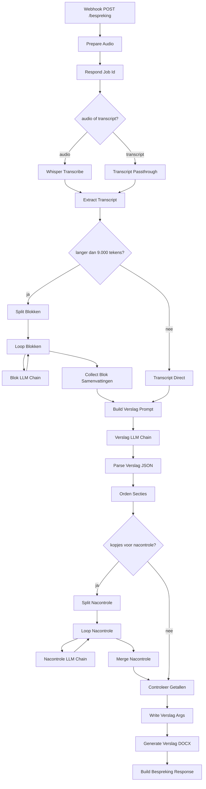

# Besprekingsverslag — workflow en prompts

Wat er gebeurt tussen "opname klaar" en "verslag in de map", en welke tekst er
precies naar Whisper en naar het taalmodel gaat.

Bron: `n8n/demo-data/workflows/bespreking-workflow.json` (workflow *Bespreking
naar Verslag*, 31 nodes plus 3 notities). De prompts hieronder staan er letterlijk in; de
`${...}`-stukken worden per bespreking ingevuld.

---

## 1. In vogelvlucht



Er zijn **vier momenten waarop een model wordt aangeroepen**: Whisper voor de
transcriptie, en daarna qwen2.5:7b in drie rollen — per blok, voor het verslag,
en voor gerichte nacontrole. Alles daartussen is gewone code.

De verdeling van werk is een bewuste keuze: **het model levert inhoud, de code
bepaalt de vorm.** Volgorde van kopjes, filteren van lege meldingen, controle op
getallen — dat gebeurt allemaal deterministisch, omdat instructies daarover in de
prompt bij dit model herhaaldelijk niet bleken te werken.

---

## 2. Fasen, zoals de webapp ze toont

De HTTP-respons gaat direct na node 2 terug (alleen een `job_id`); de rest draait
door op de achtergrond. De webapp pollt `GET /webhook/job-status?job=…`.

| fase | status | wat er draait |
|---|---|---|
| 1 | `transcriberen` | Whisper |
| 2 | `samenvatten` | blokken (met `blok_voortgang` "3/7") en de verslagronde |
| 3 | `document` | DOCX genereren |
| — | `klaar` / `fout` | eindresultaat in het jobbestand |

Het jobbestand staat in `shared/jobs/<job_id>.json` en bevat het volledige
transcript. Die bestanden worden bij elke nieuwe bespreking opgeruimd zodra ze
ouder zijn dan 24 uur.

---

## 3. Stap voor stap

### Prepare Audio
Leest de multipart-upload uit: één WAV plus de velden `dossier`, `onderwerp`,
`deelnemers`, `datum`, `duur_seconden`, `soort` en `context`. In plaats van audio mag ook een
kant-en-klaar `transcript` mee — dan wordt Whisper overgeslagen (zo test je de
samenvatting zonder transcriptieruis).

Het veld **`context`** is de vrije waarneming van de behandelaar: wat je niet uit
de opname kunt horen maar wel bij het dossier hoort ("mevrouw is 88 en stottert",
"de heer voerde vrijwel het hele gesprek"). Die tekst gaat drie kanten op, en
bewust niet naar Whisper — zie [§5.6](#56-waarnemingen-van-de-behandelaar).

Bepaalt ook het **soort bespreking**. Staat `soort` niet vast, dan wordt het
onderwerp vergeleken met `herken_op` uit de sjablonen, waarbij het *langste*
passende trefwoord wint — anders belandt een levenstestament onder het
testamentsjabloon, want "testament" zit in "levenstestament".

Maakt het jobbestand aan en ruimt oude op.

### Whisper Transcribe
`POST http://host.docker.internal:8910/inference`, temperature 0, taal nl,
timeout 20 minuten. De server draait native op de Mac (Metal); zie
`shared/whisper/start-whisper-server.sh` voor model en VAD-instellingen.

### Extract Transcript
Knipt het transcript in blokken van 9.000 tekens, op zinseinde. Eén blok ≈ een
kwartier spreektijd en past ruim in de 8.192 tokens context. Is er maar één blok,
dan gaat het transcript rechtstreeks naar de verslagprompt.

### Split Blokken → Blok LLM Chain (map)
Eén LLM-aanroep per blok. Met sjabloon vat elk blok meteen samen **onder de vaste
kopjes**. Dat is bewust: eerst vatte deze stap vrij samen en moest de verslagronde
de flarden alsnog sorteren. Dat lukte niet — bij een bespreking van 46 minuten
bleven 14 van de 17 kopjes leeg, omdat de details die je nodig hebt om iets te
herkennen in de samenvatstap al waren weggevallen.

Elk blok krijgt een deterministische hint mee: welke kopjes hebben hier een
trefwoord staan? Puur op tekstvergelijking, zonder model.

### Build Verslag Prompt → Verslag LLM Chain (reduce)
Bouwt het eindverslag uit óf het hele transcript, óf de deelsamenvattingen.

### Orden Secties
Het inhoudelijke hart, en volledig code. Hier gebeurt:

1. **Volgorde afdwingen** — de sjabloonvolgorde, want het model laat kopjes weg,
   hernoemt ze of wisselt ze om.
2. **Blokpunten eerst** — die zijn gemaakt met het volledige transcriptdeel in
   beeld, de verslagronde ziet alleen samengevatte flarden.
3. **Echo's weren** — het model schreef de *aanwijzing* achter een kopje over als
   inhoud, waardoor "Tweetrapsmaking" gevuld leek terwijl het nooit ter sprake kwam.
4. **Lege meldingen weren** — "Niet besproken", "Geen specifieke voogdij". Een
   woordenlijst bijhouden bleek dweilen; er staat nu een regel die generaliseert:
   begint een punt met een ontkenning en blijft er ná het wegstrepen van de
   kopwoorden niets inhoudelijks over, dan is het kopje leeg. "Geen bewind; wel een
   toelichting in het concept" houdt wél inhoud over en blijft dus staan.
5. **`ter_sprake` markeren** — een kopje dat leeg bleef terwijl zijn trefwoord wél
   in het transcript valt, krijgt een markering. Typisch als ergens van wordt
   afgezien ("de vaccinatieclausule? nee, laat maar zitten").

### Split Nacontrole → Nacontrole LLM Chain
Voor precies die gemarkeerde kopjes gaat één gerichte vraag terug naar het model,
met alleen de fragmenten rond het trefwoord (700 tekens ervoor en erna, maximaal
drie stukken). Klein en gefocust, in plaats van nog eens het hele transcript.

Een sjabloonsectie kan ook `altijd_nacontrole: true` krijgen; op dit moment
gebruikt geen enkele sectie dat.

### Controleer Getallen
Elk getal in het verslag moet terug te vinden zijn in het transcript. Lastig punt:
Whisper schrijft getallen nu eens als cijfer ("60%", "2008") en dan weer voluit
("vierhonderdvijftigduizend"). Daarom wordt van elk getal ook de Nederlandse
woordvorm gemaakt en dáárop gezocht. Wat niet terug te vinden is, wordt in het
DOCX gemarkeerd.

### Generate Verslag DOCX
`python3 /data/shared/genereer_besprekingsverslag.py --args-file …`. De argumenten
gaan via een tijdelijk JSON-bestand en niet over de commandline, omdat het
transcript cliëntgegevens bevat.

---

## 4. Modelinstellingen

Alle drie de chains draaien op **qwen2.5:7b** via Ollama, native op de Mac.

| chain | temperature | numPredict | numCtx | keepAlive |
|---|---|---|---|---|
| Blok | 0 | 1024 | 8192 | 30m |
| Verslag | 0.1 | 2048 | 8192 | 30m |
| Nacontrole | 0 | 512 | 8192 | 30m |

Alle drie met `format: json`. Twee valkuilen die hier zijn ingelopen:

- **`numCtx` moet in camelCase.** De n8n-node negeert een andere schrijfwijze
  stilzwijgend en valt terug op 2048, waarna lange prompts onzichtbaar worden
  afgekapt.
- **Met `format: json` staat het geparste object in `$json` zelf**, niet in
  `$json.text`. De parse-nodes vangen beide vormen af.

`numPredict` stond ooit op 512 voor de blokken; dat kapte de JSON middenin af en
kostte de hele run.

---

## 5. De prompts, letterlijk

### 5.1 Whisper — initial prompt

```
Notariële bespreking. Onderwerp: ${onderwerp}. Aanwezig: ${deelnemers}.
```

Kort, en bewust **zonder lijst van vaktermen**. Gemeten op een echte bespreking
van 55 minuten kostte zo'n lijst van 29 termen 900 woorden inhoud (5.620 tegen
6.545) en verdubbelde hij de hallucinatielussen; met large-v3 stortte de
transcriptie zelfs volledig in (795 woorden). De enige winst was een betere
spelling van "langslevende". Een korte prompt met namen houdt het naamvoordeel
zonder die schade.

Whisper kapt de initial prompt sowieso af rond de 224 tokens, en een lange,
lijstachtige prompt zonder natuurlijke zinsbouw lokt herhaling uit.

### 5.2 Blokprompt — mét sjabloon

Zo ziet elke blokaanroep eruit bij een testament- of levenstestamentbespreking:

```
Hieronder staat deel ${i} van ${totaal} van een automatisch transcript van een notariële bespreking (${sjabloonnaam}).

Orden wat er in DIT deel is besproken onder de vaste kopjes hieronder. Gebruik uitsluitend wat er staat; verzin niets.

KOPJES (de tekst achter de dubbele punt is een aanwijzing voor jou — schrijf die nooit over als inhoud)
- Familiesituatie: ${aanwijzing}
- Vermogenssituatie: ${aanwijzing}
- ... (alle kopjes uit het sjabloon)

LET OP — in dit deel vallen woorden die horen bij: ${raakkopjes}. Kijk of die kopjes hier gevuld moeten worden. Het omgekeerde geldt ook: een kopje dat hier niet tussen staat, is hier waarschijnlijk niet aan de orde.

REGELS
- Schrijf wat er over het onderwerp is gezegd, met de inhoud erbij.
- Een kopje blijft alleen leeg als het onderwerp helemaal niet ter sprake kwam.
- Hooguit zes punten per kopje, één korte zin per punt.
- Noem concrete namen, bedragen en percentages als die vallen; juist die maken het punt bruikbaar.
- Twijfel je onder welk kopje iets hoort, kies dan het meest specifieke kopje dat past. Gebruik "${laatsteKop}" alleen als het echt nergens onder valt.

Geef alleen geldige JSON terug:
{
  "secties": {
    "Familiesituatie": [],
    "Vermogenssituatie": [],
    ...
  },
  "afspraken": ["afspraken die in dit deel zijn gemaakt"],
  "namen": ["namen of rollen die in dit deel vallen"]
}

TRANSCRIPT-DEEL
${blok}
```

De aanwijzingen staan er **voluit** in, niet afgekort. Met korte hints zakte het
aantal gevulde kopjes van 11 naar 8 en belandden de legaten weer onder "Overige".
De prompt wordt er groot van (~12.600 tekens), maar sinds de blokken één voor één
draaien is dat geen probleem.

`${laatsteKop}` komt uit het sjabloon en is niet hardgecodeerd — anders breekt het
zodra de restpost wordt hernoemd.

### 5.3 Blokprompt — zonder sjabloon

Bij een algemene bespreking (geen testament of levenstestament):

```
Hieronder staat deel ${i} van ${totaal} van een automatisch transcript van een notariële bespreking.

Vat dit deel samen in korte, feitelijke punten. Gebruik uitsluitend wat er staat; verzin niets. Laat een lijst alleen leeg als er echt niets over gezegd is.

Houd het compact: hooguit acht punten per lijst en één korte zin per punt. Een te lang antwoord wordt afgekapt en is dan onbruikbaar.

Geef alleen geldige JSON terug:
{
  "besproken": ["korte punten over wat er in dit deel is besproken"],
  "afspraken": ["afspraken die in dit deel zijn gemaakt"],
  "namen": ["namen of rollen die in dit deel vallen"]
}

TRANSCRIPT-DEEL
${blok}
```

### 5.4 Verslagprompt

```
Je bent notarieel secretaris. Hieronder staat het materiaal van een bespreking op een notariskantoor. Werk het uit tot een zakelijk verslag.

HARDE REGELS
- Gebruik uitsluitend wat er staat. Verzin geen namen, bedragen, data of afspraken.
- Weet je iets niet, laat het veld dan leeg (lege string of lege lijst). Vul nooit iets aan "voor de volledigheid".
- Het transcript is machinaal gemaakt en kan verhaspelingen bevatten. Neem een naam of bedrag alleen op als die duidelijk uit de tekst blijkt.
- Schrijf in zakelijk Nederlands, derde persoon, verleden tijd.
- Geef alleen geldige JSON terug, zonder toelichting eromheen.

CONTEXT
Onderwerp volgens de behandelaar: ${onderwerp}
Dossiernummer: ${dossier}
Bekende deelnemers: ${deelnemers}

VASTE INDELING (${sjabloonnaam})
Vul "onderwerpen" met exact deze kopjes, in deze volgorde, en gebruik de kop letterlijk zoals hier geschreven. Wat wel is besproken maar nergens onder valt, hoort onder het laatste kopje.

De tekst achter het streepje is een aanwijzing vóór jou over wat er onder dat kopje hoort. Schrijf die aanwijzing NOOIT over als inhoud.

Een kopje krijgt alleen een lege lijst als het onderwerp helemaal niet ter sprake kwam.

1. Familiesituatie — ${aanwijzing}
2. Vermogenssituatie — ${aanwijzing}
... (alle kopjes)

JSON-SCHEMA
{
  "titel": "korte titel van de bespreking",
  "samenvatting": "Begin met waaróver de bespreking ging en wat de uitkomst was — bijvoorbeeld: het bestaande testament is doorgenomen en blijft in stand, met één wijziging: de voogdij. Daarna 4 tot 7 zinnen met de hoofdpunten. Som geen kopjes op.",
  "onderwerpen": [{"kop": "onderwerp", "punten": ["wat er over gezegd is"]}],
  "afspraken": ["concrete afspraken die zijn gemaakt"],
  "open_vragen": ["vragen die in de bespreking onbeantwoord bleven"]
}

TRANSCRIPT
${transcript}
```

Bij een lange bespreking staat er in plaats van `TRANSCRIPT` het kopje
`SAMENVATTINGEN PER DEEL (de bespreking is in ${n} delen samengevat)`.

De aanwijzing over volgorde staat er wel in, maar de volgorde wordt daarna
alsnog in code afgedwongen. Deze regel dient om de inhoud onder het juiste kopje
te krijgen, niet om op het model te vertrouwen voor de vorm.

### 5.5 Nacontroleprompt

Eén aanroep per gemarkeerd kopje:

```
Hieronder staan fragmenten uit een transcript van een notariële bespreking.

VRAAG
Wat is er in deze bespreking gezegd over: ${kop}?
Daaronder valt: ${aanwijzing}

REGELS
- Antwoord alleen op basis van de fragmenten. Verzin niets.
- Gaat het onderwerp in deze fragmenten ergens anders over, geef dan een lege lijst.
- Hooguit drie korte zinnen.

Geef alleen geldige JSON terug:
{"punten": ["korte zin"]}

FRAGMENTEN
${fragment}

[...]

${fragment}
```

Een sjabloonsectie mag een eigen `vraag` meegeven; dan vervangt die de
standaardvraag en vervalt de regel "Daaronder valt: …".

Het antwoord wordt streng gefilterd voordat het in het verslag komt: punten
korter dan 9 tekens vallen af, net als antwoorden die óver de vraag gaan in plaats
van erop ("bevindt zich niet in de gegeven fragmenten") of die alleen de kop
herhalen. Liever een kopje dat gemarkeerd blijft als "kwam ter sprake" dan een
schijnantwoord in het verslag.

### 5.6 Waarnemingen van de behandelaar

Het contextveld uit de webapp. Het gaat naar drie plekken, en naar Whisper juist
niet — de initial prompt kort houden is gemeten belangrijker dan wat een
waarneming daar zou toevoegen.

**1. Bovenaan elke blokprompt**, zodat het model weet hoe het de tekst moet
lezen. Bij iemand die hakkelt is een herhaling ruis en geen nadruk:

```
ACHTERGROND VAN DE BEHANDELAAR (over hoe het gesprek verliep, niet over de inhoud — schrijf dit nooit over als punt)
${context}
```

**2. In het CONTEXT-blok van de verslagprompt**, op één regel samengevouwen:

```
Waarnemingen van de behandelaar over het verloop van het gesprek (niet uit het transcript; gebruik ze om het gesprek te duiden, neem ze niet over als besproken punt): ${regel} | ${regel}
```

**3. Letterlijk in het verslag**, als kopje *Waarnemingen behandelaar* vóór de
samenvatting, met de aantekening "Genoteerd door de behandelaar zelf; niet
afkomstig uit de opname." Dat gebeurt in `Parse Verslag JSON`, op precies dezelfde
manier als de deelnemers: rechtstreeks uit het invoerveld, één regel per
waarneming, zonder dat het model eraan komt. Het staat daarmee ook buiten de
getalcontrole — "88" is de leeftijd die de behandelaar noteerde en hoeft niet in
het transcript te staan.

Twee keer staat er in de prompt dat het geen besproken punt is, en toch filtert
`Orden Secties` een punt weg dat te veel op een waarnemingsregel lijkt. Dat is
hetzelfde vangnet als voor de aanwijzingen, om dezelfde reden: dit model schrijft
achtergrondtekst geregeld over als inhoud, en de waarneming staat verderop toch al
in het verslag.

---

## 6. De sjablonen

`shared/templates/besprekingen/*.json`. Elke sectie heeft:

```json
{
  "kop": "Besproken punten",
  "aanwijzing": "Punten die in dit gesprek zijn doorgenomen en die niet onder een van de andere kopjes vallen. Gaat het om een bestaand testament, dan ook welke wijzigingen de cliënten daarin willen en wat ongewijzigd blijft.",
  "trefwoorden": ["wijziging", "wijzigingen", "wijzigen", "aanpassen", "..."]
}
```

De drie velden doen elk iets anders:

- **`kop`** — bepaalt de volgorde in het verslag en de kop in het DOCX.
- **`aanwijzing`** — gaat naar het model, in de blokprompt én de verslagprompt.
- **`trefwoorden`** — worden **nooit** naar het model gestuurd als lijst. Ze
  sturen de blokhint, ze bepalen welke kopjes nacontrole krijgen, en ze markeren
  "hier is over gesproken" bij een leeg kopje.

Optioneel: `vraag` (eigen nacontrolevraag) en `altijd_nacontrole` (altijd langs de
nacontrole, ongeacht of het kopje gevuld is).

### Testament — 20 kopjes

Familiesituatie · Vermogenssituatie · Aanleiding en status · Besproken punten ·
Eerste erfstelling · Tweede erfstelling · Derde erfstelling · Plaatsvervulling en
onterving · Rechtskeuze · Soort testament · Opeisingsgronden en rente ·
Uitsluitingsclausule · Dertigdagenclausule · Tweetrapsmaking · Voogdij · Bewind ·
Executele · Legaten · Uitsluiting ouderlijk vruchtgenot · Overige aandachtspunten

Herkend op: testament, testamenten, erfenis, nalatenschap, uiterste wil.

### Levenstestament — 16 kopjes

Familiesituatie · Vermogenssituatie · Wie wordt gevolmachtigde · Opvolgend
gevolmachtigde · Ondervolmacht · Omvang van de volmacht · Beperkingen ·
Schenkingsbevoegdheid · Toezichthouder · Bancaire gevolmachtigde · Extra clausules
· Bijzondere vermogensbestanddelen · Niet-vermogensrechtelijke zaken ·
Mentorschap, curatele en bewind · Vaccinatieclausule · Overige aandachtspunten

Herkend op: levenstestament, levensvolmacht, volmacht bij leven.

Beide beginnen met Familiesituatie en Vermogenssituatie, en beide eindigen met
dezelfde restpost.

**Let op bij hernoemen:** de restpost heette even "Overige besproken punten en
aandachtspunten". Gemeten liep hij daardoor vol van 1–4 naar 22–27 punten, omdat
de naam te veel leek op "Besproken punten" en het model niet meer wist waar iets
heen moest. Een kop die op een andere kop lijkt, is duur.

---

## 7. Waar je wat aanpast

| wat je wilt veranderen | waar |
|---|---|
| kopjes, volgorde, aanwijzingen, trefwoorden | `shared/templates/besprekingen/*.json` |
| Whisper-model, VAD, beam size | `shared/whisper/start-whisper-server.sh` |
| prompts | de code-nodes in `n8n/demo-data/workflows/bespreking-workflow.json` |
| opmaak van het DOCX | `shared/genereer_besprekingsverslag.py` |
| opnemen, microfoonkeuze, waarnemingen, pollen | `webapp/src/components/Besprekingen.tsx` |

Een verslag opnieuw draaien vanaf een uitgeschreven transcript, zonder opnieuw op
te nemen:

```bash
./scripts/verslag-uit-tekst.sh transcript.txt 2026.1044 "Bespreking testament" "mr. Van Dijk, mevrouw Jansen"
```

---

## 8. Wat gemeten is

Nuttig om te weten voordat je aan de prompts gaat sleutelen: bij dit model werken
instructies over vórm structureel niet, en deterministische nabewerking wel. Dat
is inmiddels op vier punten bevestigd — volgorde van kopjes, het weglaten van
lege kopjes, het vastleggen van afgewezen keuzes, en het onderscheid tussen optie
en besluit (3 van de 46 punten kregen een label; die stap is er weer uit).

Meetmethode die hier wordt aangehouden: een écht transcript, **drie runs**, tegen
een handmatig opgestelde goudlijst. Eén run zegt niets — twee keer eerder leidde
dat tot een conclusie die bij hermeting niet klopte.

Stand na de laatste wijziging, testamentbespreking van 55 minuten, drie runs:
14 van de 20 kopjes gevuld, restpost 6–8 punten, en steeds dezelfde zes lege
kopjes (Rechtskeuze, Dertigdagenclausule, Tweetrapsmaking, Voogdij, Bewind,
Uitsluiting ouderlijk vruchtgenot) — die onderwerpen komen in dat gesprek niet voor.
